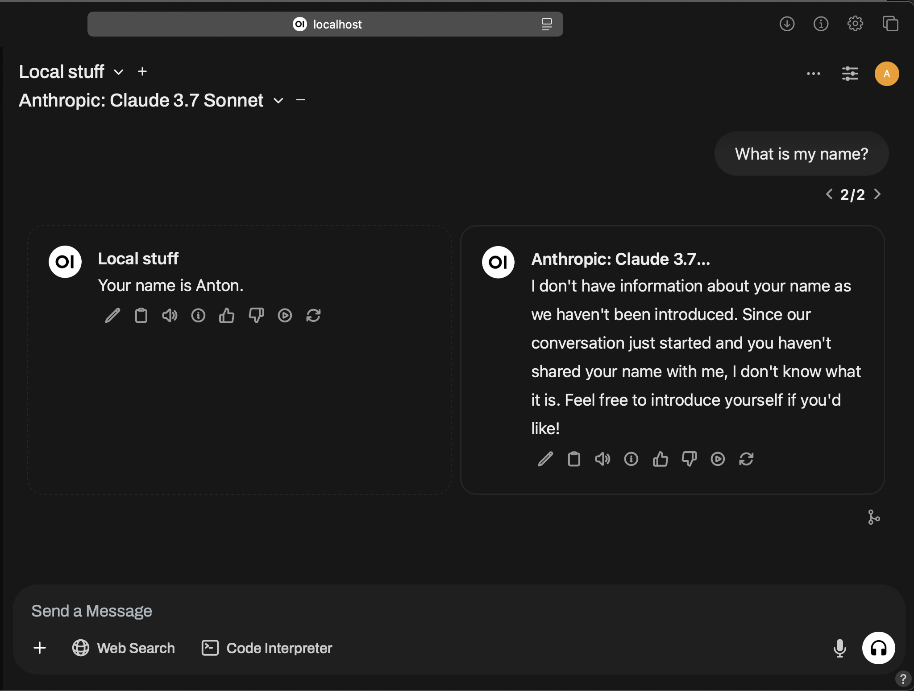
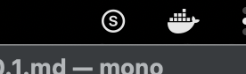

# What is this?
openAI API proxy on localhost that implements RAG and forwards enriched LLM chat completions to Anthropic.

1. Install this on your laptop
2. Add knowledge with [https://testflight.apple.com/join/JQmCe33j](https://testflight.apple.com/join/JQmCe33j)
3. Verify it works with [http://localhost:3000](http://localhost:3000)
4. Point your LLM tools to endpoint: [http://localhost:12345/v2](http://localhost:12345/v2)

All used components are open source.

# Who is this for?
Software developers & individuals who use LLMs for coding (and other tasks).


# What can you do with this?
Be more productive.
When LLMs have the right knowledge - they dont hallucinate answers that nobody needs.

Sven is a tool for you to guide LLMs to the right answers through your knowledge.
You knowledge is: code snippets, guides, conventions, TODOs, findings, ideas, rly anything that you add.

P.S.
Personal example: when you saved knowledge about your custom View component, and the next day LLM used it naturally, that's a magical moment.


# Example
`Sonnet with` vs `Sonnet without` knowledge.

"My name is Anton" was a text snippet that I saved to my knowledge.


# What is this (take 2)?
Sven for Developers lets you transparently integrate your knowledge into your existing LLM worflows.

NOTE: any reference to openAI API is a reference to LLM API Spec, and not OpenAI company and their models. Sven for Developers defaults to Anthropic (you may config it to use Mistral, OpenAI, or local self-hosted LLM).

Sven exposes openAI-like API endpoint on `localhost` (your laptop), receives your LLM query, searches for any related knowledge that you have saved previously, and forwards enriched LLM request further to LLM provider (Anthropic).

In a way it is an openAI to Anthropic LLM proxy with knowledge RAG in the middle.

Knowledge is stored locally on you computer. Only data that leaves your laptop is a request to LLM provider (Anthropic).
You may choose to host and use your own LLM too (e.g. w/ vllm, LMStudio). Default is Anthropic because it is pretty good at coding.

Even a 3B LLM with the right data will give a better answer than a gigantic Sonnet trained on all-of-internet (since it can only hallucinate due to absence of correct knowledge).
But, a gigantic Sonnet + the right data (e.g. conventions about your project's source code, your custom View component) = ✨


# Installation
Installation requires Docker.
Tested on Mac & Linux.

Clone this gh repo & 1-Click install in Terminal:
```bash
./install.sh
```

You need to set `ANTHROPIC_API_KEY` ENV var on your system. Sven is currently using Anthropic because it is great for coding. It uses `sonnet-3.7-latest` for dev asks and `haiku-3.5-latest` for casual chatting.


# Note: Your first query will be slow
Sven needs to download 2 models (~1GB).
To find the best documents matches RAG uses these 2 models:
[Alibaba-NLP/gte-modernbert-base](https://huggingface.co/Alibaba-NLP/gte-modernbert-base)
[Alibaba-NLP/gte-reranker-modernbert-base](https://huggingface.co/Alibaba-NLP/gte-reranker-modernbert-base)
The first LLM query will be slow because it downloads model files: ~1GB.
If you want to use other models for sentence similarity and/or reranking you may change model IDs in `embed_local.py` and `rerank_local.py` files.


# Once installed these services will be available on you computer
- Open WebUI
	Will be accessible at [http://localhost:3000](http://localhost:3000)
	Open WebUI will be pre-configured with `local` and `dev` knowledge models. If you see 0 LLM models after setting up your admin account - wait a minute for `sven-llm-api` docker container to complete setting things up.
	Pre-configured models:
	- `Local`: Default model for personal knowledge, ideas, etc... Forwards requests to `haiku`.
	- `Dev`: Save you code snippets, how-to's, guides here. Forwards requests to `sonnet`.
	- `Blackhole` this model does not save knowledge (used by Open-WebUI for summarization, etc). Forwards requests to `haiku`.
- /v2 openAI API endpoint
	Will be accessible at [http://localhost:12345/v2](http://localhost:12345/v2)
	Bearer access token: anything, random string (This is your personal `localhost` installation, hence nothing to protect)
	Note this is /v2, not /v1 - indicating that this is v1 + Knowledge RAG = /v2
	It is the same API Spec as /v1, with an addition that it manages knowledge too.
	Point any of the AI tools that you use to this endpoint. E.g. your VS Code extension accepts openAI base URL? - feed http://localhost:12345/v2 to it!


# Adding knowledge
Use Sven mac app available on TestFlight at [https://testflight.apple.com/join/JQmCe33j](https://testflight.apple.com/join/JQmCe33j).
Open the app and follow the instructions. The app lets you easily save any text as knowledge.
Recommended hotkeys: `Cmd+Shift+S` to save to default knowledge base and `Cmd+Shift+D` to save to Dev base.

App's icon in status bar will blink when hotkey pressed and knowledge saved:


### Save small pieces of text
Sven does not implement intelligent chunking yet. 
Small snippets of text or code are better for reference / search capability.
Plus it would keep LLM tokens usage sane (and your Anthropic $ bill).
- While you can save whole source code files this is not advised.

###  API: in case you are implementing a feature
Simply use `POST embeddings` endpoint.
openAI's standard API embeds text via `POST /v1/embeddings`.
Sven's `POST /v2/embeddings` embeds plus saves text to your knowledge.
`model` parameter specifies the knowledge base where to save the text.
Use `local` or `local/dev`.

Then when you do `/chat/completions` with `local` or `local/dev` model - the knowledge base will be used to find relevant information.
By default `local` forwards requests to `Haiku` and `local/dev` to `Sonnet`.


# Anthropic's Citations
Related knowledge is sent to Anthropic via their [Citations feature](https://docs.anthropic.com/en/docs/build-with-claude/citations).
For Mistral (or other openAI Provider APIs) knowledge is directly attached to conversations after user's text like so:
```
<user text>

Knowledge available to you:
=====
Up-to-date info:
-----
<found knowledge 1>
Up-to-date info:
-----
<found knowledge 2>
```


# LLM Tools
This is WIP. Sven proxy currently does not forward `tools` to Anthropic.


# Data persistence
Knowledge you save to Sven is saved to chromadb. Its `/data` folder is mapped to `~/sven/chromadb-data` on your laptop.
In case you may need to backup things.


# Bonus: ollama
Sven-llm-api also exposes ollama http API interface.
This is a minimal implementation that supports listing models and doing chat completions only.
Yet it is sufficient for some clients.
I use it with Enchanted mac app [AppStore](https://apps.apple.com/app/id6474268307), [Source Code](https://github.com/gluonfield/enchanted) - it is great for bringing text from other apps (Safari) to LLM via system-wide keyboard hotkeys - they call it [Completions](https://svenai.com/mighty-workflows-with-less-known-ai-tools/).

OLLama endpoint: [http://localhost:12345](http://localhost:12345)
NOTE: no `/v2` suffix.


